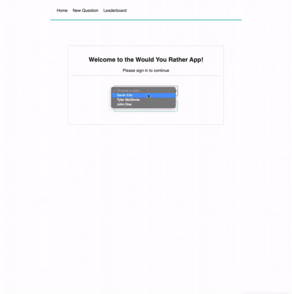

# Would You Rather Project

A React web application that allows a user to play the game "Would you Rather?". In this game, users are able to answer questions created by other players, ask questions, and see the current ranking of the users.

Website is hosted at [Netlify](https://would-you-rather-react.netlify.app/).

  

## Instructions

1. Clone the repo or download all the files
2. Assuming you have Node.js installed, navigate to the project folder and install all the dependencies with `npm install`
3. Start the development server with `npm start`

## Authors

* Ivan Cheng 
